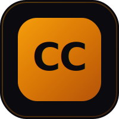

<p align="center">
  
</p>

<h1 align="center">Claude Settings Editor</h1>

<p align="center">
  A visual GUI editor for Claude Code <code>settings.json</code> files.<br>
  Single standalone HTML file — no build step, no server, no dependencies to install. Just open and edit.
</p>

<p align="center">
  
  
  
  
  
</p>

## Quick Start

**Option A — Manual:**
1. Download `claude-settings-editor.html`
2. Open in any Chromium browser (Chrome, Edge, Arc)
3. Click **Open** to load your `settings.json`
4. Edit visually, then **Save** back to disk

**Option B — Auto-Detect (recommended):**
1. Download the repo (or just `claude-settings-editor.html` + `open-editor.py`)
2. Run the companion script:
   ```bash
   python open-editor.py
   ```
3. The script finds all your `settings.json` files, lets you pick one, and opens the editor pre-loaded

```
  Claude Settings Editor — Auto-Detect
  ========================================

  Found 3 settings files:

    [1] User (global)
        Your personal settings, apply to ALL projects
        C:\Users\you\.claude\settings.json

    [2] Project (shared)
        Project settings, committed to git. Shared with team.
        /repo/.claude/settings.json

    [3] Local (gitignored)
        Personal project overrides, NOT committed.
        /repo/.claude/settings.local.json

  Priority: Local > Project > User > Defaults
```

On Windows, you can also double-click `open-editor.bat`.

> Uses the [File System Access API](https://developer.mozilla.org/en-US/docs/Web/API/File_System_Access_API) for direct read/write. Works best in Chromium-based browsers.

## Features

### Core
- **15 Tabs** covering every `settings.json` option
- **6 Languages** — full i18n support (Deutsch, English, Español, Français, 日本語, Português)
- **Live JSON Preview** — see the output as you edit
- **File System Access API** — open and save `settings.json` directly (no copy-paste)
- **Auto-Detect** — point to your home or project folder, finds `.claude/settings.json` automatically
- **File Scope Indicator** — shows whether you're editing a Global or Project config
- **Templates** — built-in presets + save/load your own custom templates
- **Import/Export Bundles** — backup settings + templates + spinner packs as a single JSON file
- **Share via URL** — Base64-encoded settings in the URL hash for easy sharing
- **Guided Setup Wizard** — 6-step onboarding for first-time users (includes language selection)
- **Roundtrip-safe** — unknown properties are preserved on import/export

### Tabs

| Tab | What it covers |
|-----|----------------|
| General | Model, effort level (visual card selector), output style, language, thinking mode, fast mode, voice, vim mode, theme, release channel, file suggestions, model overrides |
| Permissions | Allow/Ask/Deny rules, default mode, presets, conflict detection |
| Skills & Plugins | Toggle 80+ plugins with categories, search, availability badges, 35+ custom skills |
| Hooks | 25 events in 7 groups, 4 handler types (command, http, prompt, agent), conditional `if` + `shell` |
| MCP Servers | stdio/http/sse config, env vars, headers, 14 quick-add presets, status check |
| Sandbox | Mode (restrict/monitor), filesystem allow/deny/read paths, network domains |
| Environment | Custom environment variables |
| Display & UI | Spinner verbs (8 themed packs + custom), status line, motion preferences |
| Attribution | Commit and PR attribution strings |
| Advanced | API key helper, plans directory, cleanup period, available models |
| Companion Tools | 14 recommended tools for the Claude Code workflow (Happy Coder, Warp, LazyGit, etc.) |
| Design Prompts | 30 curated design styles with AI prompts and color palettes + [designprompts.dev](https://www.designprompts.dev/) |
| Terminal Prompts | 26 prompts in 9 categories + CLAUDE.md Builder |

### Editing Tools
- **Drag & Drop** — reorder permission rules, hook groups, sandbox paths by dragging
- **Settings Validation** — real-time warnings for invalid values, missing fields, duplicates
- **Permission Conflict Detection** — warns when Allow and Deny rules overlap
- **Settings Diff View** — compare current settings against defaults or a custom template
- **Global Search** — find any setting across all tabs (`/` shortcut)
- **Undo/Redo** — 50-step history with debounced snapshots (`Ctrl+Z` / `Ctrl+Y`)
- **MCP Server Status Check** — test button to verify HTTP/SSE server connectivity

### Permission Presets

| Preset | Mode | Description |
|--------|------|-------------|
| Safety First | acceptEdits | Broad allow list + comprehensive deny rules |
| Productive | acceptEdits | Common dev tools allowed, minimal deny |
| Read Only | plan | Read/Glob/Grep only, no writes |
| Lockdown | default | Minimal rights, maximum deny list |
| Full Send | bypassPermissions | Everything allowed, only destructive ops denied |

### Keyboard Shortcuts

| Shortcut | Action |
|----------|--------|
| `Ctrl+S` | Save file |
| `Ctrl+Z` / `Ctrl+Y` | Undo / Redo |
| `Ctrl+1-9` | Switch tabs |
| `Ctrl+Shift+P` | Toggle JSON preview |
| `/` | Focus global search |
| `?` | Show shortcuts overlay |
| `Esc` | Close modals |

### Accessibility
- Keyboard-navigable toggles with `role="switch"` and `aria-checked`
- ARIA roles for tabs, modals, alerts, search results
- Label associations for all form inputs
- Focus trapping in modal dialogs
- WCAG AA contrast ratios

### Design
- Dark theme (off-black `#0A0A0F` base with amber `#F59E0B` accent)
- Glassmorphism panels with noise texture overlay
- Staggered tab transition animations
- Collapsible sidebar with icon-only mode
- Responsive layout with mobile-friendly header
- Touch-friendly drag handles

## Tech Stack

- **[Tailwind CSS](https://tailwindcss.com/)** via CDN — utility-first styling
- **[Alpine.js](https://alpinejs.dev/)** — reactive state without a build step
- **JetBrains Mono** + **DM Sans** — font stack
- **File System Access API** — native browser file read/write

Zero dependencies. No `node_modules`. No `package.json`. Just one HTML file.

## Browser Support

| Browser | Support |
|---------|---------|
| Chrome / Edge / Arc | Full (File System Access API) |
| Firefox | Partial (fallback file input, no direct save) |
| Safari | Partial (fallback file input, no direct save) |

## License

MIT
